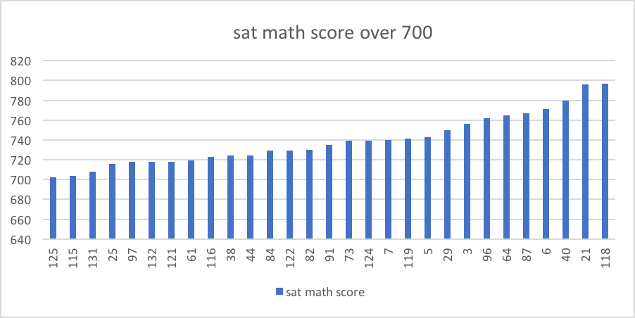
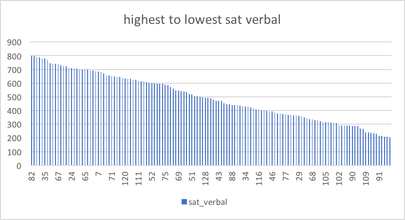
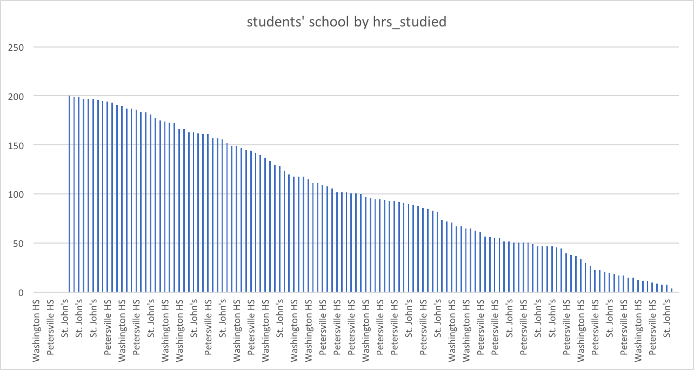
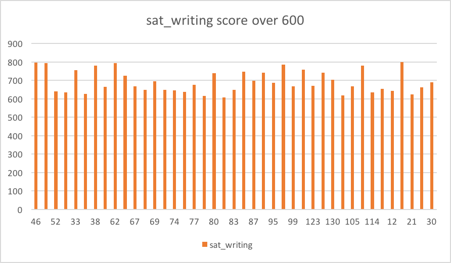
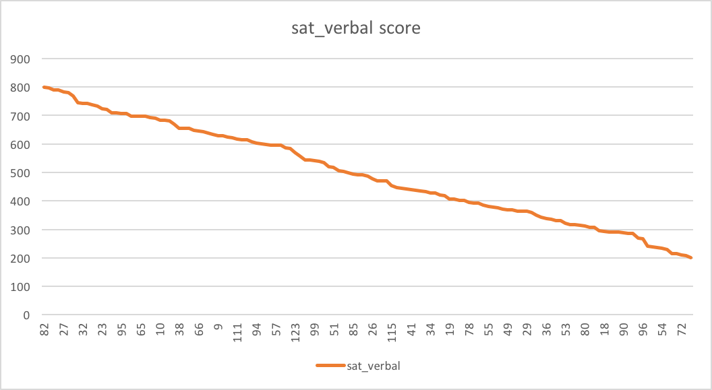

# ICA4_Perlie
--which student has the sat_math score over 700?
```SELECT sat_math, student_id
 FROM datasets.sat_scores
 WHERE sat_math >=700
 ORDER BY sat_math ASC
```


--rank the student from highest to lowest by sat_verbal?
```SELECT sat_verbal, student_id
 FROM datasets.sat_scores
 ORDER BY sat_verbal DESC
```


--rank the students’ school from highest to lowest by hrs_studied
```SELECT school, hrs_studied
FROM datasets.sat_scores 
ORDER BY hrs_studied DESC
```


--which students has the sat_writing scores over 600?
```SELECT student_id, sat_writing 
FROM datasets.sat_scores
WHERE sat_writing >600
ORDER BY sat_scores ASC 
```


--which students has the highst sat_verbal score?
```SELECT student_id, sat_verbal
FROM datasets.sat_scores
ORDER BY sat_verbal DESC
```

